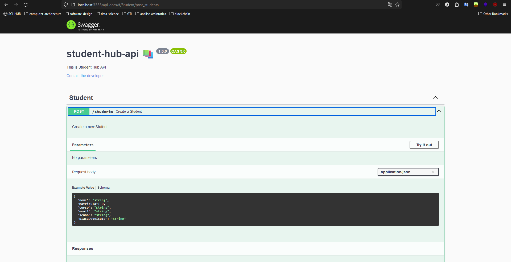

# 🧠 student-hub-api


## 🚀 How to run


1. Clone o projeto e acesse o seguinte diretório no terminal:

```bash
$ git clone https://github.com/LogicGateDynamics/student-hub-api.git
$ cd student-hub-api
```

2. Instale as dependências do projeto:

```bash
# Instale as dependências
$ npm i
```

3. Inicie a aplicação:

```bash
# Inicie a aplicação
$  npm run start
```

## 📚 Documentação



  ```bash
# Após iniciar a aplicação acesse a url:

http://localhost:3333/api-docs
```
